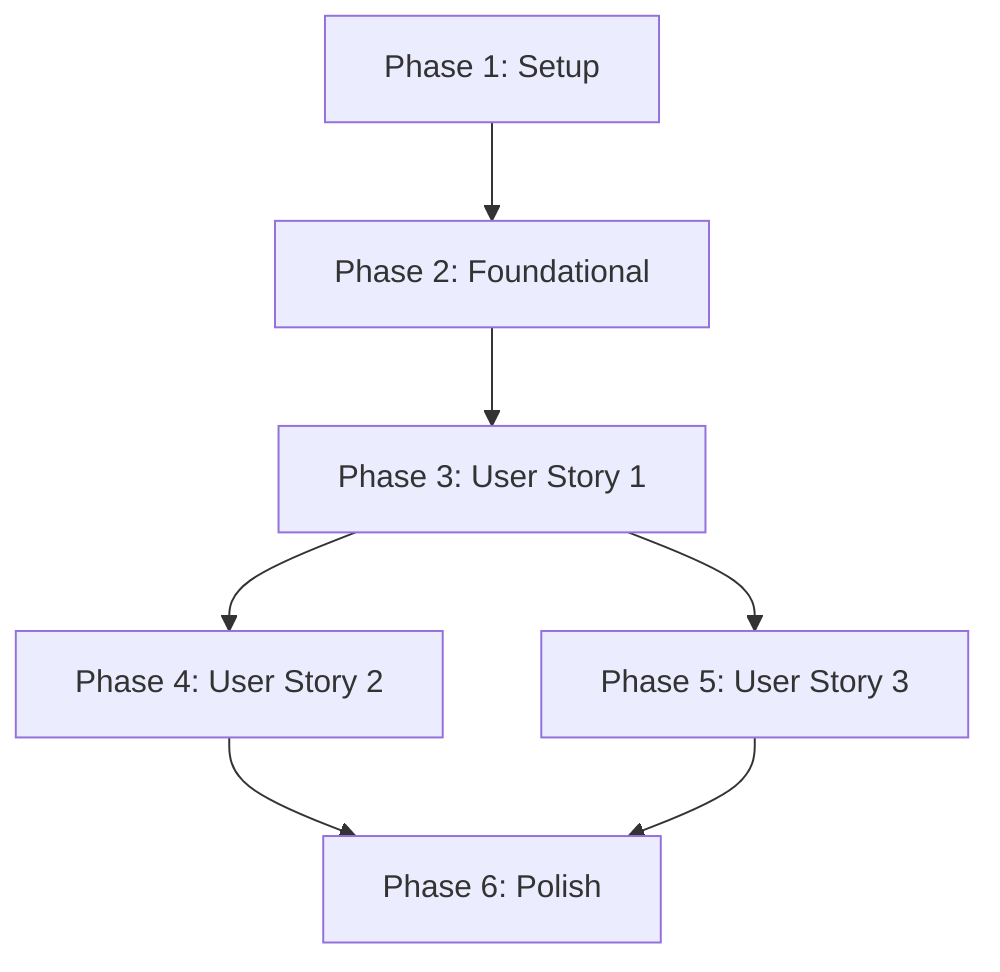

# Task Breakdown: Philippine Bank Status Monitor

**Feature**: Philippine Bank Status Monitor
**Branch**: 002-ph-bank-status
**Date**: 2026-05-10

## Overview

Breaking down implementation into independently testable user stories from spec.md. Each story phase can be developed and deployed separately.

## Implementation Strategy

**MVP**: User Story 1 only (Current Status Dashboard)
**Incremental**: Add US2 (Historical), then US3 (Multi-Bank View - minimal additional work)

## Task Summary

- **Setup**: 5 tasks (Nuxt project, D1 database, dependencies)
- **Foundational**: 4 tasks (D1 schema, health check worker, circuit breaker, API routes)
- **User Story 1** (P1 - Current Status): 6 tasks
- **User Story 2** (P2 - Historical): 3 tasks  
- **User Story 3** (P2 - Multi-Bank View): 2 tasks (mostly satisfied by US1)
- **Polish**: 4 tasks (deployment, documentation, E2E testing, performance testing)
- **Total**: 24 tasks

## Phase 1: Setup

**Goal**: Initialize project infrastructure

- [x] T001 Initialize Nuxt 3 project with TypeScript (npx nuxi@latest init phbanksstatus --packageManager npm)
- [x] T002 [P] Install dependencies: NuxtUI, Chart.js, @cloudflare/workers-types
- [x] T003 [P] Configure wrangler.toml with D1 binding and Scheduled Worker
- [ ] T004 Create D1 database (wrangler d1 create phbanksstatus-local)
- [x] T005 Set up test infrastructure: Vitest config, Playwright config

## Phase 2: Foundational (Blocking Prerequisites)

**Goal**: Core backend infrastructure needed by all user stories

- [x] T006 Create D1 schema.sql (banks, endpoints, status_checks, rate_limit_counters tables) in server/db/schema.sql with automated 30-day retention purge via DELETE WHERE created_at < date('now', '-30 days')
- [x] T007 Implement D1 query utilities in server/db/queries.ts (getCurrentStatus, getHistoricalData, insertCheckResult, purgeOldRecords)
- [x] T008 Implement health check worker in server/scheduled/check-banks.ts (HTTP ping, timeout/retry logic, status determination, call purgeOldRecords after checks)
- [x] T009 Implement circuit breaker in server/utils/circuit-breaker.ts (check counters, halt at 96%)

## Phase 3: User Story 1 - View Current Bank Service Status (P1)

**Story Goal**: Users can view current status of all 6 banks on dashboard load

**Independent Test**: Load dashboard, verify all 24 status indicators display with correct state and timestamp

**Tasks**:

- [x] T010 [P] [US1] Create Bank and Endpoint TypeScript types in types/status.ts
- [x] T011 [US1] Implement /api/status route in server/api/status.get.ts (query D1, return current status)
- [x] T012 [P] [US1] Create BankStatusCard component in components/BankStatusCard.vue (single bank display with color-coded status)
- [x] T013 [P] [US1] Create CircuitBreakerBanner component in components/CircuitBreakerBanner.vue (warning when rate limited)
- [x] T014 [US1] Implement useStatusPoll composable in composables/useStatusPoll.ts (60s polling logic)
- [x] T015 [US1] Create main dashboard page in pages/index.vue (layout all 6 banks, auto-refresh)

## Phase 4: User Story 2 - Review Historical Service Outages (P2)

**Story Goal**: Users can view 30-day status timeline for any bank

**Independent Test**: Click bank to view history, verify timeline chart displays 30 days of data

**Tasks**:

- [x] T016 [US2] Implement /api/history/[bankSlug].get.ts route (query D1 for 30-day historical data, use route param bankSlug)
- [x] T017 [P] [US2] Create StatusTimeline component in components/StatusTimeline.vue (Chart.js timeline, incident tooltips)
- [x] T018 [US2] Add historical view to dashboard page (expand on click, fetch from /api/history/{bankSlug})

## Phase 5: User Story 3 - Monitor Multi-Bank View (P2)

**Story Goal**: All 6 banks visible on single page with summary indicators

**Independent Test**: Load dashboard, verify all 6 banks listed without navigation, summary count visible

**Tasks**:

- [x] T019 [P] [US3] Add summary indicator to dashboard ("All banks operational" or "2 banks experiencing issues")
- [x] T020 [US3] Add visual distinction (red/yellow/green) to BankStatusCard for at-a-glance scanning

## Phase 6: Polish & Cross-Cutting Concerns

**Goal**: Production readiness

- [ ] T021 Configure Cloudflare Pages deployment (build command, output directory)
- [x] T022 [P] Write deployment documentation in README.md (D1 setup, wrangler commands)
- [x] T023 E2E tests: Dashboard load, auto-refresh, historical timeline, circuit breaker banner (tests/e2e/dashboard.spec.ts)
- [ ] T024 [P] Performance testing: Lighthouse CI for <1s page load (SC-001), query timing verification for <2s history load (SC-003)

## Dependencies

**User Story Dependencies**:
- US1 blocks US2, US3 (both depend on dashboard infrastructure)
- US2 and US3 are independent of each other (parallel)

## Parallel Execution Opportunities

**Within User Story 1**:
- T012 (BankStatusCard), T013 (CircuitBreakerBanner) can run in parallel (different components)

**Within User Story 2**:
- T017 (StatusTimeline component) can run in parallel with T016 (API route) once types are defined

**Within User Story 3**:
- T019 and T020 can run in parallel (different UI concerns)

**Polish Phase**:
- T022 (docs), T023 (E2E tests), and T024 (performance tests) can all run in parallel with T021 (deployment config)

## MVP Scope (Recommended First Deployment)

**Phases 1-3 only** (Setup, Foundational, User Story 1):
- T001-T015 (15 tasks)
- Delivers: Functional dashboard with current status, auto-refresh, circuit breaker
- Validates: Core value proposition before building historical features

**Post-MVP Increments**:
1. Add US2 (Historical): T016-T018 (3 tasks)
2. Polish US3 (Multi-Bank View): T019-T020 (2 tasks)
3. Production deployment: T021-T024 (4 tasks)
